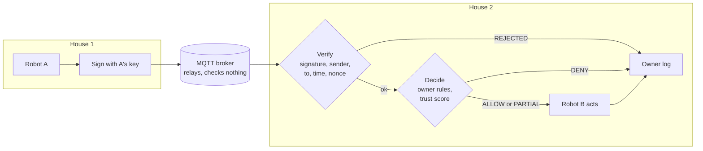

# robot-trust-network

A trust layer for robots from different owners to work together safely.

Each household's robot sits on its own isolated network. A request from another household's robot passes through a gatekeeper with two steps: **verify** (is it really that robot?) and **decide** (how far should we follow it?). Only then does the robot act, and the owner sees a plain-language log line.

## Pipeline

The broker can read every message. Signing proves who sent it and that nothing changed on the way; it does not hide it.

## What works today

**Network** (`network/`)
- Signed messages with Ed25519 over canonical JSON
- Verifier that rejects unsigned, unknown or revoked senders, bad signatures, wrong recipient, stale time and replayed nonces
- Trust policy: ALLOW, PARTIAL or DENY per action and trust score, with actions that are never allowed (`unlock_door`)
- Two robots in terminals (`robot.py`), four attacks (`attack.py`: unsigned, spoof, replay, tamper), all rejected
- Link monitor in the browser showing connections, messages, verdicts and the broker log
- Five-stage presentation story (`demo.py`)

**Simulation** (`sim/`)
- `sim/mujoco_houses/`: Unitree G1 and Go1 walking in MuJoCo on published walking policies
  - basic: drive one G1 with WASD
  - duo: a G1 leader and a G1 or Go1 follower linked only through the broker; the follower moves only after a signed request is allowed
  - houses: two RoboCasa kitchens in separate windows talking over MQTT
- `sim/vla_sim.py`: a vision-language model driving a Panda arm or Go2 through skill calls

## Known gaps
- Only the first "follow me" request is signed. The leader's position stream after that is plain JSON, so anyone on the topic could steer the follower.
- A key revoked mid-task is not noticed until the next request.
- Messages to an offline robot are lost (QoS 0).

## Layout

| Folder | Team | What lives there |
|---|---|---|
| `network/` | Network team | Message signing and verification, key registry, replay protection, MQTT transport, trust and decision rules |
| `sim/` | Simulation team | MuJoCo robots (Unitree demos, VLA sim), later Isaac Sim |
| `docs/` | Everyone | Shared message format, architecture, slides |

Start with [`docs/message-format.md`](docs/message-format.md). Both teams build against it, so change it only by agreement.

For a presentation-ready MQTT story, start the link monitor and run
`python network/demo.py --delay 0.9`; see [`network/README.md`](network/README.md#automatic-presentation-demo).
For the walking robots, see [`sim/mujoco_houses/README.md`](sim/mujoco_houses/README.md).

## Roadmap
1. Two robots talk over a shared ROS 2 network
2. Two isolated containers talk only through an MQTT broker, with signed messages (signing done, containers next)
3. Robots in separate containers talk inside the simulator (MuJoCo duo runs over MQTT, not yet in containers)
4. Two real robots in the lab, not on the same server
