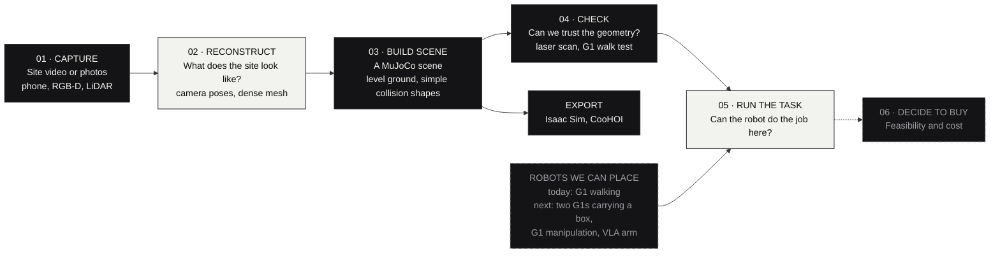
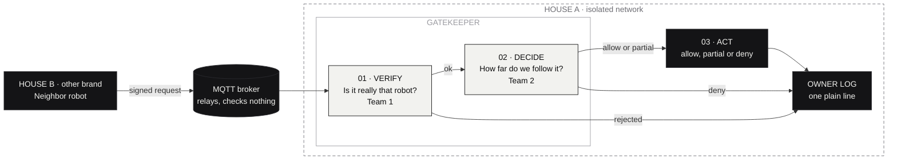

# robot-trust-network

Three pipelines live here. The first turns a real site into a simulation, so we can check that a robot can do the job there before anyone buys it. The second is a trust layer, so robots from different owners can work together safely. The third starts from video of a line that already runs with people and ends with which robots to buy for it.

## Pipeline 1: site to simulation

```mermaid
flowchart LR
    C["01 · CAPTURE<br/>Site video or photos<br/>phone, RGB-D, LiDAR"]
    R["02 · RECONSTRUCT<br/>What does the site look like?<br/>camera poses, dense mesh"]
    S["03 · BUILD SCENE<br/>A MuJoCo scene<br/>level ground, simple collision shapes"]
    K["04 · CHECK<br/>Can we trust the geometry?<br/>laser scan, G1 walk test"]
    T["05 · RUN THE TASK<br/>Can the robot do the job here?"]
    F["06 · DECIDE TO BUY<br/>Feasibility and cost"]
    E["EXPORT<br/>Isaac Sim, CooHOI"]
    P["ROBOTS WE CAN PLACE<br/>today: G1 walking<br/>next: two G1s carrying a box,<br/>G1 manipulation, VLA arm"]
    C --> R --> S --> K --> T
    T -.-> F
    S --> E
    P --> T
    classDef stage fill:#141416,stroke:#2C2C30,color:#F2F2EF
    classDef focus fill:#F2F2EF,stroke:#0B0B0C,color:#0B0B0C
    classDef next fill:#141416,stroke:#6E6E74,color:#9A9AA0,stroke-dasharray:6 4
    class C,S,K,E stage
    class R,T focus
    class F,P next
```

Dashed boxes are next. Today the G1 walks in reconstructed scenes; the other robots still run in their own scenes. Heavy reconstruction runs on a Colab GPU, and the geometry is scored against laser scans (ETH3D, Hilti 2022 construction site). The Isaac Sim export will open on an AWS GPU machine with a live screen (g6e.2xlarge, L40S); setup is in [`docs/isaac-sim-hosting.md`](docs/isaac-sim-hosting.md).

## Pipeline 2: trust network

```mermaid
flowchart LR
    B["HOUSE B · other brand<br/>Neighbor robot"]
    Q[("MQTT broker<br/>relays, checks nothing")]
    subgraph A["HOUSE A · isolated network"]
        subgraph G["GATEKEEPER"]
            V["01 · VERIFY<br/>Is it really that robot?<br/>Team 1"]
            D["02 · DECIDE<br/>How far do we follow it?<br/>Team 2"]
        end
        X["03 · ACT<br/>allow, partial or deny"]
        L["OWNER LOG<br/>one plain line"]
    end
    B -- signed request --> Q
    Q --> V
    V -- ok --> D
    D -- allow or partial --> X
    X --> L
    V -- rejected --> L
    D -- deny --> L
    classDef stage fill:#141416,stroke:#2C2C30,color:#F2F2EF
    classDef focus fill:#F2F2EF,stroke:#0B0B0C,color:#0B0B0C
    class B,Q,X,L stage
    class V,D focus
    style A fill:none,stroke:#6E6E74,stroke-dasharray:6 4,color:#6E6E74
    style G fill:none,stroke:#9A9AA0,color:#9A9AA0
```

The broker can read every message. Signing proves who sent it and that nothing changed on the way; it does not hide it. The simulation side uses this too: in the MuJoCo duo demo, the follower robot moves only after the leader's signed request is allowed.

## Pipeline 3: line video to robot decision

```mermaid
flowchart LR
    V["01 · CAPTURE<br/>Line video<br/>plus a one-page intake"]
    P["02 · POSE AND SCENE<br/>Worker 3D pose, conveyor,<br/>work zones"]
    E["03 · TIME STUDY<br/>Work elements, standard time,<br/>variability, ergonomics"]
    A["04 · AUTOMATABILITY<br/>Which elements can a robot take?"]
    R["05 · ROBOT CATALOG<br/>15 commercial arms, reach,<br/>payload, MuJoCo task times"]
    O["06 · OPTIMIZE<br/>Human-robot split, line balance,<br/>1,219 designs to 3 options"]
    S["07 · LINE SIM<br/>DES, 30 replications"]
    D["08 · DECIDE<br/>ROI and RFQ per station"]
    V --> P --> E --> A --> R --> O --> S --> D
    classDef stage fill:#141416,stroke:#2C2C30,color:#F2F2EF
    classDef focus fill:#F2F2EF,stroke:#0B0B0C,color:#0B0B0C
    class V,P,R,S,D stage
    class E,A,O focus
```

Pipeline 1 starts from an empty site. This one starts from a line that is already running with people on it. It splits the work into elements, scores which ones a robot could take, matches commercial robots, and ends with three options for the customer (layout only, one robot, three robots) with ROI for each. It runs on the public CarDA car-door line. A video-only mode (no mocap) lands on the same recommendation type and robot count. Details are in [`robot_consult_demo/README.md`](robot_consult_demo/README.md).

## What works today

**Network** (`network/`)
- Signed messages with Ed25519 over canonical JSON
- Verifier that rejects unsigned, unknown or revoked senders, bad signatures, wrong recipient, stale time and replayed nonces
- Trust policy: ALLOW, PARTIAL or DENY per action and trust score, with actions that are never allowed (`unlock_door`)
- Two robots in terminals (`robot.py`), four attacks (`attack.py`: unsigned, spoof, replay, tamper), all rejected
- Link monitor in the browser showing connections, messages, verdicts and the broker log
- Five-stage presentation story (`demo.py`)

**Simulation** (`sim/`)
- `sim/mujoco_houses/`: Unitree G1 and Go1 walking in MuJoCo on published walking policies
  - basic: drive one G1 with WASD
  - duo: a G1 leader and a G1 or Go1 follower linked only through the broker; the follower moves only after a signed request is allowed
  - houses: two RoboCasa kitchens in separate windows talking over MQTT
  - coop carry: two full-body G1s carrying one box (`run_coop_carry`)
- `sim/sunny-scene-recon/`: a scanned site turned into a MuJoCo scene, checked against a laser scan, with a G1 walk test and an Isaac Sim export
- `sim/sunny-isaac-sim/`: Isaac Sim 6.2 on a cloud GPU (a Brev L40S, or a Colab L4 through pip): recorded robot demos, several robots sharing a job inside a reconstructed real loading area, the CooHOI two-humanoid carry in Isaac Lab, the CarDA car-door line, and Seohee's factory rendered in Isaac Sim
- Every simulation so far, with results and caveats: [`docs/simulations.md`](docs/simulations.md)
- `sim/sam-g1-manipulation/`: a G1 with grippers, picking actions from camera images (experimental)
- `sim/vla_sim.py`: a vision-language model driving a Panda arm or Go2 through skill calls

**Line video to robot decision** (`robot_consult_demo/`)
- Stages s0 to s9 run end to end on a laptop in about 2 minutes, each behind a JSON contract and an acceptance gate
- Time study, automatability scoring, robot catalog matching, line balancing, DES and ROI on the CarDA door line
- Three customer options picked from 1,219 evaluated designs, plus simulation packages for each option

## Known gaps
- A key revoked mid-task is not noticed until the next request.
- Messages to an offline robot are lost (QoS 0).

## Layout

| Folder | Team | What lives there |
|---|---|---|
| `network/` | Network team | Message signing and verification, key registry, replay protection, MQTT transport, trust and decision rules |
| `sim/` | Simulation team | MuJoCo robots (Unitree demos, manipulation, VLA sim), site reconstruction, Isaac Sim export |
| `robot_consult_demo/` | IE team | Line video to robot recommendation: time study, automatability, robot catalog, line balancing, DES, ROI |
| `docs/` | Everyone | Shared message format, architecture, slides, Isaac Sim hosting |

Start with [`docs/message-format.md`](docs/message-format.md). Both teams build against it, so change it only by agreement.

For a presentation-ready MQTT story, start the link monitor and run
`python network/demo.py --delay 0.9`; see [`network/README.md`](network/README.md#automatic-presentation-demo).
For the walking robots, see [`sim/mujoco_houses/README.md`](sim/mujoco_houses/README.md).

## Roadmap
1. Two robots talk over a shared ROS 2 network
2. Two isolated containers talk only through an MQTT broker, with signed messages (signing done, containers next)
3. Robots in separate containers talk inside the simulator (MuJoCo duo runs over MQTT, not yet in containers)
4. Two real robots in the lab, not on the same server
